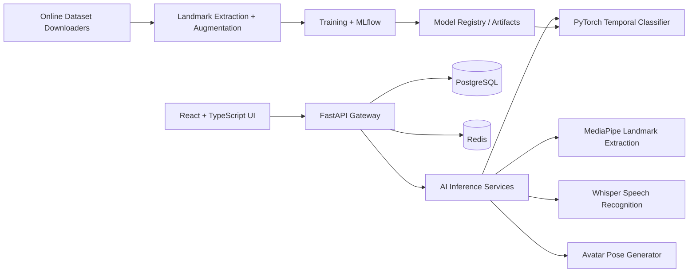

# SignBridge AI

SignBridge AI is a production-oriented, AI-integrated platform for bidirectional sign-language communication across web, desktop, and mobile surfaces. It includes a React/TypeScript frontend, FastAPI backend, reproducible online dataset ingestion, MediaPipe/PyTorch inference abstractions, MLflow-ready training scripts, Docker deployment assets, and accessibility-first UX.

## Capabilities

- Real-time sign language to text and speech with webcam capture, confidence scoring, bounding-box/landmark overlays, FPS telemetry, and conversation saving.
- Image-to-sign translation with drag-and-drop upload and speech/sign recreation outputs.
- Text-to-sign and speech-to-sign pipelines with sign-sequence generation and animated AI avatar playback.
- Live conversation mode for simultaneous sign-to-text/speech and speech-to-sign translation.
- Accessibility controls: large text, high contrast, dark mode, voice feedback, keyboard navigation, screen-reader labels, and color-blind friendly mode.
- Multilingual-ready architecture for English, Hindi, Hinglish, ISL, ASL, and additional future languages.
- Online public dataset pipeline for WLASL, MS-ASL, ASLLVD, AUTSL, and Indian Sign Language sources.
- Training/inference scaffolding for CNN+LSTM and Transformer-based temporal landmark classifiers with quantization/export hooks.

## Architecture



## Repository layout

```text
frontend/             React/Vite/Tailwind client
backend/              FastAPI app and AI service layer
ml/                   Online dataset ingestion, preprocessing, training, export
infra/                Docker, NGINX, database schema, deployment helpers
docs/                 Architecture, dataset, model, security, and operations docs
.github/workflows/    CI pipeline
```

## Quick start

### Frontend

```bash
npm --prefix frontend install
npm --prefix frontend run dev
```

### Backend

```bash
python -m venv .venv
. .venv/Scripts/activate  # Windows PowerShell: .venv\Scripts\Activate.ps1
pip install -e backend[dev]
uvicorn app.main:app --app-dir backend --reload
```

Optional AI dependencies for full local inference:

```bash
pip install -e backend[ai,dev]
```

The backend is designed to run without heavyweight AI packages installed: it exposes the same API contracts with deterministic fallback inference, then automatically switches to MediaPipe/PyTorch/Whisper when model artifacts and optional dependencies are present.

### Docker Compose

```bash
docker compose -f infra/docker/docker-compose.yml up --build
```

## Online training data

Large datasets are not committed. Use reproducible scripts to download metadata and datasets into `/data/signbridge` or a configured path:

```bash
python ml/data/download_datasets.py --catalog ml/datasets/catalog.yaml --dataset wlasl --output data/raw
python ml/data/preprocess_landmarks.py --input data/raw --output data/processed --languages ASL ISL
python ml/training/train_temporal_transformer.py --config ml/configs/temporal_transformer.yaml
```

Supported online sources are documented in `docs/datasets.md`. Some datasets require acceptance of license terms or Kaggle credentials.

## Quality checks

```bash
npm --prefix frontend run lint
npm --prefix frontend run typecheck
npm --prefix frontend run build
pip install -e backend[dev]
pytest backend/tests ml/tests
```

## Security and privacy

- Webcam/microphone processing is opt-in and clearly controlled by the user.
- Raw video/audio is not stored by default; saved conversations persist derived transcripts and metadata.
- Dataset downloads are source-attributed and kept outside git.
- API payload limits, CORS configuration, and production secret management are documented in `docs/security.md`.
